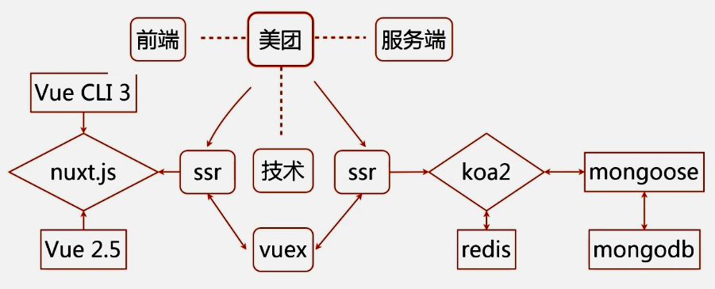
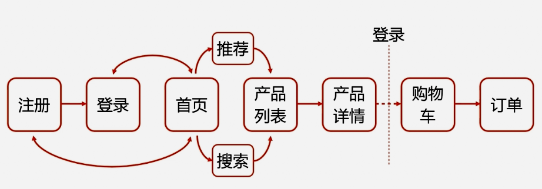
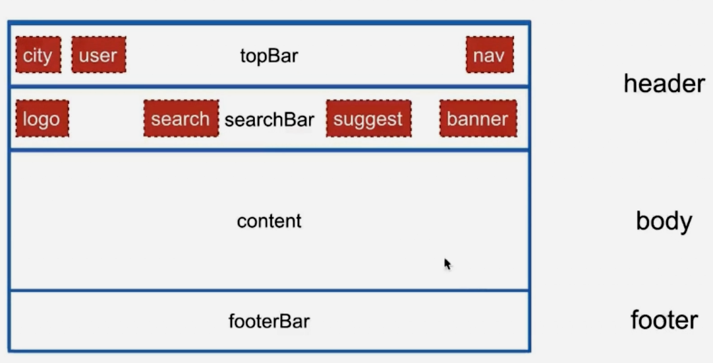
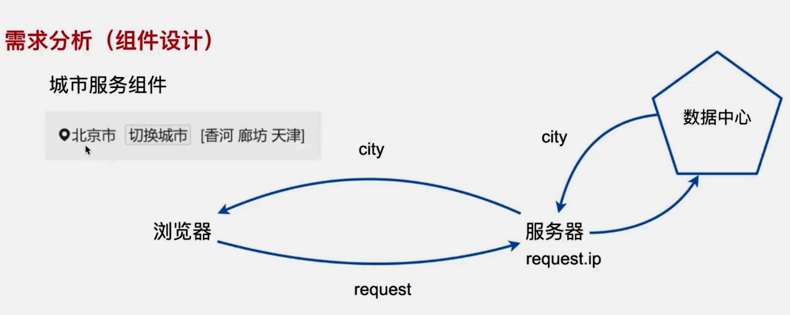
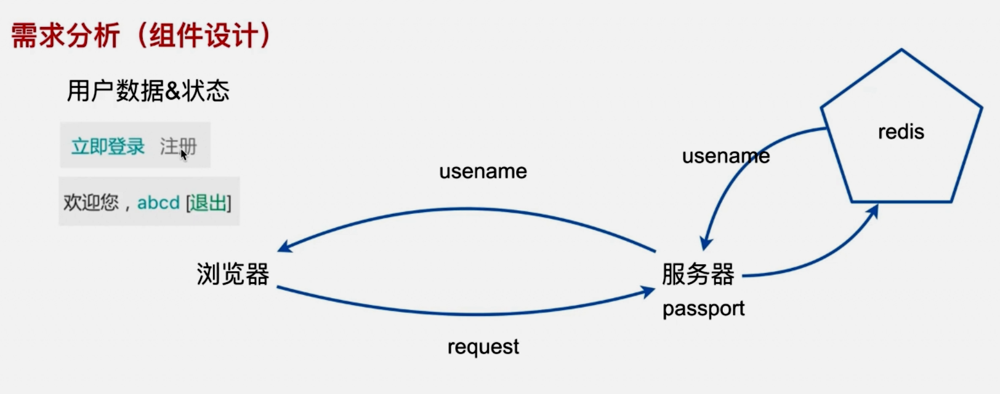

# 高仿美团web网

## 项目介绍

### 业务内容

- 首页
- 登录/注册
- 产品列表
- 产品详情
- 购物车
- 订单

### 技术



### 主要内容

- 登录/注册
- SMTP服务
- 城市服务
- 推荐服务
- 搜素服务
- 地图服务
- 购物车
- 订单设计
- 组件复用设计
- 接口设计
- 数据对象模型



## vue 环境搭建

```sh
vue-cli@3
vue@2.5
npm i -g @vue/cli
yarn global add @vue/cli
vue -V
vue create vue-learn
cd vue-learn
```

### 模板语法

- 文本: `{{ msg }}`
- 原始HTML: `<span v-html="rawHtml"></span>`
- 特性：`<div v-bind:id="dynamicId"></div>`
- 表达式：`{{ number + 1 }}{{ ok ? 'YES': 'NO' }} {{ message.split('').reverse().join('') }}`
- 指令: `<p v-if="seen">如果seen为true</p>`
  - 自定义指令：无需组件就可以实现，又不能表达式解决的
- 修饰符：`<form v-on:submit.prevent="onSubmit">...</form>`
- 缩写：`<a :href="url" @click="doSomething">点我呀</a>`

### 计算属性

- `<template v-for="item in list"><li :key="item">{{ item }}</li></template>`

### 组件

- props: 组件的参数传递
- slot：插槽在组件抽象设计中的应用
- 自定义事件：父子组件的通信方式
  - 子组件发送给父组件：`@click="$emit('patch')"`
  - 父组件接受子组件事件：`@patch="something"`

### 路由

```sh
npm i vue-router -S
vim src/pages/{a,b}.vue

vim router.js
  import Vue from 'vue'
  import VueRouter from 'vue-router'
  import pageA from './pages/a.vue'
  import pageB from './pages/b.vue'

  Vue.use(VueRouter)

  const routes = [
    {
      path: '/',
      component: pageA
    },
    {
      path: '/pageb',
      component: pageB
    },
  ]
  const router = new VueRouter({
    routes
  })
  export default router

vim main.js
  import router from './router'
  new Vue({
    router
  }).$mount('#app')

vim vue.config.js
  module.exports = {
    runtimeCompiler: true
  }
vim public/index.html
  <div id="app">
    <router-view></router-view>
    <router-link to="/pagea">pagea</router-link>
    <router-link to="/pageb">pageb</router-link>
  </div>
yarn serve
```

## nuxt

- Vue 2
- Vue Router
- Vuex(includes only when using the store option)
- Vue Server Render(excluded when using mode: 'spa')
- vue-meta

### nuxt 工作流

- Incoming Request(浏览器发起请求)
- nuxtServerInit(Store action): 执行nuxtServerInit 函数
- middleware(nuxt.config.js, maching layout, matching page & children)

### nuxt 安装

```sh
npm i -g @vue/cli-init
vue init nuxt-community/koa-template nuxt-learn
cd nuxt-learn
yarn
yarn dev

npm install backpack-core@0.7.0 --save-dev
npm install uglifyjs-webpack-plugin --save-dev

vim nuxt.config.js
    extend(config, ctx) {
      if (ctx.Client && ctx.isDev) {
        config.module.rules.push({
          enforce: 'pre',
          test: /\.(js|vue)$/,
          loader: 'eslint-loader',
          exclude: /(node_modules)/
        })
      }
    }
```

- 路由
- 页面模板
- 异步数据 && SSR
  - `npm i koa-router -S`
- Vuex应用

## koa-session

```sh
npm install koa-session  --save
```

## 环境准备

- node-12.3.1
- npm-6.9.0
- npx-10.2.0
- nuxt-?(2.0.0)
- vue-?(2.5.17)
- webpack-?(4.19.1)

## 项目安装

```sh
npm i -g npx
npx create-nuxt-app mt-app
cd mt-app
npm run dev
```

问题：DeprecationWarning: Tapable.plugin is deprecated. Use new API on `.hooks` instead

```sh
vim nuxt.config.js
process.traceDeprecation = true

或者
node --trace-deprecation node_modules/nuxt/bin/nuxt.js build
```

```sh
vim server/index.js
  const Koa = require('koa') 改成 import Koa from 'koa'
vim package.json
  "dev": "cross-env NODE_ENV=development nodemon server/index.js --watch server",
  "start": "cross-env NODE_ENV=production node server/index.js",
  改成
  "dev": "cross-env NODE_ENV=development nodemon server/index.js --watch server --exec babel-node",
  "start": "cross-env NODE_ENV=production node server/index.js --exec babel-node",

yarn add -D @babel/core @babel/node
yarn add -D sass-loader node-sass stylus stylus-loader

vim .babelrc
  "presets": ["@babel/preset-env"]
```

- 辅助工具安装
  - MongoDB
  - redis
  - pm2

## 首页开发

- 需求分析
  - 模板设计 | 组件设计 | 数据结构设计 | 接口设计



### 如何城市定位



客户端通过浏览器请求，服务器根据客户端请求的IP地址，映射到数据中心获取城市位置信息，最后此信息返回到客户端的浏览器。客户端通过vuex获取数据

### 用户数据&状态



